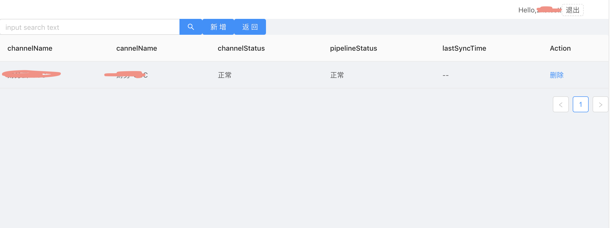

# 功能描述

## 主要特征

 1. 目前主要监控url可用性(可达性，访问时长，消息返回正确性等)，kafka队列消息堆积，和otter的channel同步状态。
 2. 结果解析表达式基于aviator。可以根据结果规则，配置有一定的灵活性。
 3. 可以推动到邮件，url或者企业微信(待实现)

## 功能演示

1. zk 
 
2. kafka 和kafka topic 的消费情况统计
 
 
3. otter 和otter channel情况统计
 
 
4. url 
 
 

5. 规则定义
 
 
 


6. 推送定义
 
  
 


# 运行说明
##  初始化工程
~~1. create-react-app monitor-ui~~
~~2. npm run eject~~
~~3. npm install --save antd~~
~~4. npm install babel-plugin-import --save-dev~~
1. 运行 npm run start 
2. 打包 npm run build


## 增加webpack alias
```
      alias: {
        // Support React Native Web
        // https://www.smashingmagazine.com/2016/08/a-glimpse-into-the-future-with-react-native-for-web/
        'react-native': 'react-native-web',
        '@src': path.resolve(__dirname, '../src'),
        '@api': path.resolve(__dirname, '../src/component/api')
      },
```

## 不能识别webpack alias?
1. 安装path intellisense?
2. 增加jsconfig.json
```
{
  "compilerOptions": {
    "module": "commonjs",
    "paths": {
      "@src/*": ["./src/*"],
      "@api/*": ["./src/component/api/*"]
    }
  }
}
```

## 与springboot 打成一个包部署
1. 修改paths.js
```
function getServedPath(appPackageJson) {
  const publicUrl = getPublicUrl(appPackageJson);
  const servedUrl =
    envPublicUrl || (publicUrl ? url.parse(publicUrl).pathname : '/');//将 / 修改为context-path
  return ensureSlash(servedUrl, true);
}
```
2. 执行  `npm run build`
3. 将build 文件夹copy到springboot的resources文件夹下

### 打个小广告
如果您想使用整个程序监控您的系统。打赏作者喝杯咖啡，可以获得整个前后端的代码哦。

 
